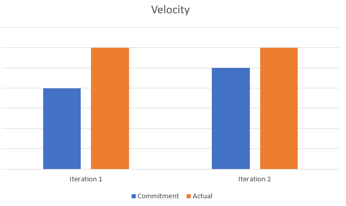

The retrospective after iteration 2 reflected the strengths and weaknesses of our team and helped us to re-evaluate certain techniques we were using for the project. In previous iterations, we did not divide the tasks amongst ourselves in an efficient manner and had certain problems while putting the project together. In iteration 2, we had problems setting the database up, so we brain stormed ideas to set the database up before beginning this iteration. We did not use gitlab to the full extent, i.e., to open/close issues timely. Although, our team members constantly communicated and worked through the problems, there were certain miscommunications, which caused some issues in the project as we ran towards the end of the iteration. This lead to unexpected errors, various code smells and our app did not run as expected which cost us several marks. 

For the next iteration(iteration 3), we decided to work on the database, refactor the code to remove code smells, organize the tasks amongst ourselves in an efficient manner, look at the iteration 3 description/rubrics time to time so we donot miss any part. We also decided to focus on implementing fewer features but in an effective way. For instance, our 'login' accepted almost every user which should not be the case. So, we decided to add another 'signup' and 'guest' feature. We also looked at some technical debts from iteration 2 that were supposed to be paid. 

For this iteration, the team will be successful, if we are able to set up the database properly and also, remove all the existing smells and bugs. We will be successful if all the features implemented ran to completion and the app did not crash in between. The user should be able to properly login/signup and is able to view the courses/programs as expected. Also, we will focus on having more useful features/user stories implemented in the iteration 3 and push the ones to 'future' in case we decide to drop them.

Velocity Charts for iteration 1 and 2 are as follows:

